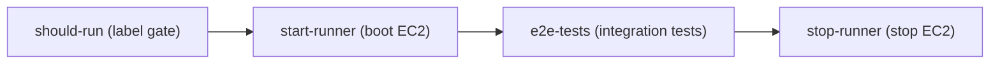

# E2E Local CI Runbook

`e2e-local.yml` runs BoxLite's VM-based integration tests on a self-hosted AWS EC2
runner. This is the operational reference for that workflow: how it runs, how it is
provisioned, and how to fix it when it breaks.

## Overview

GitHub-hosted runners cannot expose `/dev/kvm`, so BoxLite's integration tests — which boot
real microVMs through libkrun — only run on hardware that allows nested virtualization. The
workflow keeps a single **persistent** EC2 instance for this: it is started before a run,
runs the tests, then is **stopped** (never terminated) so its build and image caches survive
on the EBS volume. Because there is exactly one instance, only one e2e run executes at a
time — a newer run cancels an older queued one.

## How it runs

The workflow is four jobs:



- **should-run** — decides whether to run. Pushes and manual dispatches always run; a pull
  request runs only when a maintainer adds the `e2e-local` label.
- **start-runner** — authenticates to AWS, starts the stopped instance (or creates one if
  none exists), and waits up to 3 minutes for the self-hosted runner to come online.
- **e2e-tests** — runs on the self-hosted runner (`boxlite-e2e` label, 50-minute timeout):
  verifies `/dev/kvm`, installs build dependencies, then runs `make test:integration`.
- **stop-runner** — always runs at the end and stops the instance so it stops costing money.

### Triggers

- Push to `main` touching runtime code (`src/boxlite`, `src/shared`, `src/cli`, `src/guest`,
  `sdks/**`, any `Cargo.toml`, `Cargo.lock`, or the workflow file itself).
- A pull request labeled `e2e-local` — the label is the cost gate, and only maintainers can
  add it. The trigger is `pull_request_target`, so fork PRs get the credentials a plain
  `pull_request` run would be denied. Same-repo PRs re-run on every push while labeled; a
  fork PR runs only the head commit that was labeled — after new pushes, remove and re-add
  the label to approve the new code.
- Manual `workflow_dispatch`, with an optional `debug` input that opens an SSH session if the
  tests fail.

## Instance & auth

| Property | Value |
|---|---|
| Instance type | `c8i.4xlarge` (nested virtualization enabled) |
| AMI / region | `ami-05cf1e9f73fbad2e2` / `us-east-1` |
| Runner label | `boxlite-e2e` |
| Lifecycle | persistent — stopped between runs, never terminated |
| Storage | gp3 root volume kept across runs; holds `~/.cargo`, `target/`, and `~/.boxlite` caches |

Keeping the instance warm is what makes repeat runs fast: the first run on a fresh instance
compiles everything (~5–10 minutes of setup), and later runs reuse the cached toolchain and
build output. Cost is roughly the `c8i.4xlarge` on-demand rate while a run is in progress,
plus a few dollars a month for the persistent EBS volume — check the current `us-east-1` rate
before quoting a figure.

Authentication uses no long-lived secrets:

- **AWS** — GitHub OIDC is exchanged for short-lived STS credentials via the
  `boxlite-e2e-github-actions` IAM role. No AWS keys are stored in the repo.
- **GitHub** — a GitHub App (`boxlite-e2e-runner`) mints the runner registration token at
  run time. There is no personal access token.

## One-time setup

All AWS and GitHub infrastructure is provisioned by one script:

```bash
./scripts/ci/setup-ci-runner.sh
```

It auto-detects the AWS account, repository, default VPC, and public subnets, and is
idempotent — re-running it reconciles existing resources. Use `--skip-github` to provision
only the AWS side, or `--region` / `--vpc-id` / `--subnet-id` to override discovery.

It creates these AWS resources:

| Resource | Purpose |
|---|---|
| OIDC provider `token.actions.githubusercontent.com` | lets GitHub Actions assume an AWS role |
| IAM role `boxlite-e2e-github-actions` | what the workflow assumes (EC2 start/stop/run + pass-role) |
| IAM role + instance profile `boxlite-e2e-runner` | what the EC2 instance runs as |
| Security group `boxlite-e2e-runner` | outbound 443/80 only |

And sets these on the repository:

| Variables | Secret |
|---|---|
| `AWS_ACCOUNT_ID`, `AWS_SUBNET_IDS`, `AWS_SECURITY_GROUP_ID`, `GH_APP_ID`, `EC2_E2E_INSTANCE_ID` | `GH_APP_PRIVATE_KEY` |

The GitHub App is created through a browser manifest flow the script drives — follow its
prompts to confirm and install the app. `EC2_E2E_INSTANCE_ID` is written automatically the
first time an instance is created, so later runs find it directly.

When setup finishes, trigger a run with:

```bash
gh workflow run e2e-local.yml
```

## Troubleshooting

| Symptom | Likely cause | Fix |
|---|---|---|
| `start-runner` times out waiting for the runner to come online | the instance booted but the runner service did not register | inspect the instance's runner logs; re-run the workflow to retry registration |
| Launch fails with `InsufficientInstanceCapacity` | the AZ is out of `c8i.4xlarge` capacity | none needed — the launch loop already retries every subnet/AZ; re-run if all were exhausted |
| `e2e-tests` fails on low disk | `target/` build artifacts filled the volume | the job evicts caches at 80% use and refuses below 20 GB free; if it still fails, free space on the instance manually |
| A run can't find the instance, or targets the wrong one | `EC2_E2E_INSTANCE_ID` is stale | it self-heals via the `Name=boxlite-e2e` tag; clear the variable to force rediscovery |
| A pull request doesn't trigger the workflow | the `e2e-local` label is missing | a maintainer adds the label (it is the cost gate) |
| A labeled fork PR doesn't re-run after a push | fork approval is per-commit | remove and re-add the `e2e-local` label to approve the new head |

For an interactive session, dispatch the workflow with `debug: true`; on failure it opens a
tmate SSH session and leaves the instance running (it auto-stops after 30 minutes idle).

## References

- Workflow: [`.github/workflows/e2e-local.yml`](../../.github/workflows/e2e-local.yml)
- Provisioning script: [`scripts/ci/setup-ci-runner.sh`](../../scripts/ci/setup-ci-runner.sh)
- Build-dependency setup: [`scripts/setup/setup-ubuntu.sh`](../../scripts/setup/setup-ubuntu.sh)
- CI overview: [`.github/workflows/README.md`](../../.github/workflows/README.md)
